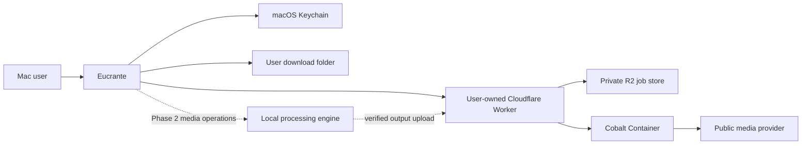
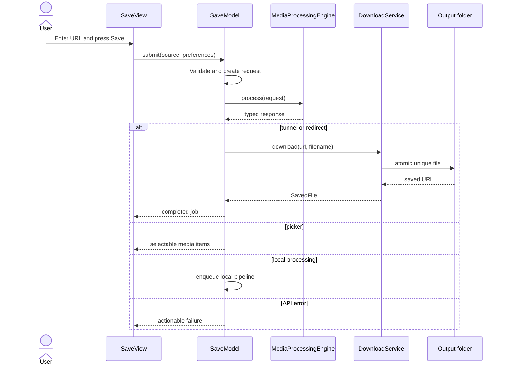

# System architecture

## Context

Eucrante is a native single-user client. It does not extract media itself in the first release; it asks a Cobalt v11 instance inside the user's own Cloudflare deployment to resolve a public URL, then downloads or locally processes the instance's typed response. The project operates no shared backend.



The trust boundary is explicit: source URLs and API responses are untrusted input; the API credential and local files are private user data.

## Technology choices

| Concern | Choice | Reason |
| --- | --- | --- |
| UI | SwiftUI with small AppKit bridges | Native windows, Settings, commands, drag/drop, accessibility |
| Language | Swift 6, strict concurrency | Type safety and actor isolation for network/file work |
| Minimum OS | macOS 14 | Modern SwiftUI/Observation APIs while retaining broad Apple-silicon support |
| Networking | Foundation `URLSession` | HTTP, streaming/download tasks, authentication, cancellation |
| Secrets | Security framework / Keychain | Avoid credentials in preferences or logs |
| Preferences | UserDefaults initially | Small stable settings surface; migrate with schema version |
| Persistent jobs | SwiftData + user-owned R2 | Fast local UI plus durable resumable cloud artifacts |
| Local media | AVFoundation first; FFmpeg evaluation | Minimize bundled executable/licensing surface |
| Diagnostics | Unified Logging (`Logger`) | Privacy annotations and Console integration |
| Packaging | Swift Package core + Xcode app target | Testable domain layer and normal signed `.app` delivery |

## Processing deployment

Every user brings their own Cloudflare account and deploys an isolated stack:

| Component | Responsibility |
| --- | --- |
| Worker | HTTPS API, Access assertion validation, request validation, routing, resumable R2 reads/writes, and deletion |
| Container | User-owned upstream-compatible Cobalt resolver and any server-required FFmpeg work |
| R2 | Private job manifests, resumable inputs, and verified outputs retained until explicit deletion |
| Mac app | User interaction, local merge/remux/transcode, verification, Music import, and local file management |

A plain Worker cannot replace the Cobalt runtime because it does not provide a normal process environment for FFmpeg. The Container preserves upstream compatibility while the Worker provides a narrow security and persistence boundary. R2 is never public and has no expiration lifecycle for completed `jobs/` objects. The detailed object and authentication contract lives in [CLOUDFLARE.md](CLOUDFLARE.md).

The end state remains hybrid: the private Container resolves provider links, R2 makes jobs durable and resumable, and the Mac performs Apple-specific merges, metadata, subtitles, and conversion locally.

One-click Apple output presets are policy layers over this pipeline. They acquire the best source, inspect its actual tracks, then choose passthrough, remux, or a single local transcode. Preset behavior and acceptance criteria are defined in [PRESETS.md](PRESETS.md); views do not construct codec settings directly.

## Module topology

```text
EucranteApp
├── App shell and commands
├── Save feature
├── Queue/history feature
├── Settings feature
└── macOS integrations
        │
        ▼
EucranteCore
├── Domain models and validation
├── MediaProcessingEngine protocol
├── CobaltAPIClient
├── DownloadService
├── KeychainStore
├── Persistence interfaces
└── LocalProcessingEngine (Phase 2)
        │
        ▼
Apple frameworks
Foundation · Security · AVFoundation · SwiftData · OSLog
```

Views own presentation only. `AppModel` coordinates the current vertical slice; as features grow it splits into `SaveModel`, `QueueModel`, and `SettingsModel`, each isolated to the main actor. Network, download, persistence, and local processing services are actors or immutable sendable values.

## Core protocols

```swift
public protocol MediaProcessingEngine: Sendable {
    func instanceInfo() async throws -> CobaltInstanceInfo
    func process(_ request: CobaltRequest) async throws -> CobaltResponse
}

public protocol MediaDownloading: Sendable {
    func download(from remoteURL: URL, suggestedFilename: String?, to directory: URL) async throws -> SavedFile
}
```

Concrete dependencies are injected into models. Tests use deterministic engines and temporary folders.

## Save sequence



## API contract

The client models the documented Cobalt v11 response discriminant:

- `tunnel`: download a Cobalt-proxied URL.
- `redirect`: download the provider URL.
- `picker`: ask the user to choose one or more media items.
- `local-processing`: download input tunnels, then merge/transcode locally.
- `error`: retain the machine code and context for mapping and diagnostics.

The endpoint configuration normalizes a trailing slash and permits HTTPS. Production setup accepts a deployment only after its versioned discovery response proves that the Worker exposes the expected API and private job-store capabilities. Plain HTTP is accepted only for loopback/private development instances. API control requests do not follow redirects; endpoint changes must be explicit so credentials cannot cross an unexpected redirect boundary. Cloudflare Access service-token material comes from Keychain and is never encoded into settings exports.

## Download and filesystem safety

- Treat `filename` and `Content-Disposition` as untrusted.
- Strip path components, control characters, and macOS-forbidden separators.
- Fall back to a stable generic filename.
- Resolve collisions with `name 2.ext`, `name 3.ext`, and so on.
- Download to a URLSession-managed temporary file, validate status, then move into the destination.
- Phase 1 adds disk-space preflight, content-length display, cancellation, background session recovery, and security-scoped output-folder bookmarks.
- Phase 2 isolates each processing job in its own temporary directory and deletes it on success, cancellation, or recovery.
- R2 objects use an opaque job UUID prefix and are served through conditional Range requests so interrupted downloads can resume without restarting.
- A completed cloud job persists until the user invokes **Delete Cloud Job** and confirms deletion. Removing a local file or queue row does not silently delete its R2 copy.

## Concurrency and state

The UI is main-actor isolated. `CobaltAPIClient`, `DownloadService`, and future `LocalProcessingEngine` are `Sendable` actors/values. A bounded scheduler will own concurrency; views never launch detached work.

Job states are explicit and monotonic except retry:

```text
queued -> resolving -> awaitingSelection -> downloading -> processing -> completed
                       \-----------------------------------------------> failed
                       \-----------------------------------------------> cancelled
```

Each transition records a timestamp and typed failure. Phase 1 persists sufficient state to restart downloads safely without persisting secrets.

## Security and privacy

- No analytics, ad SDK, third-party crash reporter, embedded web view, or account system.
- Cloudflare Access credentials live in Keychain with after-first-unlock accessibility appropriate to a desktop app.
- Logs redact source query strings, authorization headers, filesystem paths, and response bodies by default.
- Redirects remain HTTP(S); custom schemes are rejected.
- Network responses have size/time limits, status validation, and typed decoding failures.
- Public processing endpoints require HTTPS. Unauthenticated HTTP is limited to loopback/private development endpoints, and credentials are never sent over HTTP except to loopback on the same Mac.
- Local subprocesses never invoke a shell. Arguments are passed as arrays and executable locations are fixed and code-signed.
- The app does not import browser cookies or attempt to access private/DRM content.

## Distribution architecture

The recommended first channel is a private Developer ID build:

1. Xcode app target consumes `EucranteCore`.
2. Hardened Runtime and minimum entitlements.
3. Archive and sign with Developer ID Application.
4. Submit for notarization and staple the ticket.
5. Package as a signed DMG or ZIP.
6. Phase 4 adds a signed update feed after the release trust model is approved.

Mac App Store distribution remains a separate decision because sandboxed folder access and any bundled media executable need policy validation.

## Verification strategy

- Model tests: request defaults, response discriminants, URL validation, filename sanitization, collision handling.
- Network tests: custom `URLProtocol` fixtures for all statuses, malformed JSON, auth, rate limiting, redirect behavior, and timeouts.
- Integration tests: ephemeral fixture server and optional private Cobalt instance behind an environment flag.
- Processing tests: tiny licensed fixture media with golden probe metadata.
- UI tests: keyboard-only save, picker, retry, Settings, VoiceOver identifiers, reduced motion.
- Release tests: clean-machine launch, Keychain prompt behavior, output permission, code signing, notarization, quarantine launch.

## Operational diagnostics

Settings exposes a redacted diagnostics export containing app/OS version, API version and supported-service names, state transitions, stable error codes, and recent timings. It excludes full source URLs, authorization data, filenames, and media content.
