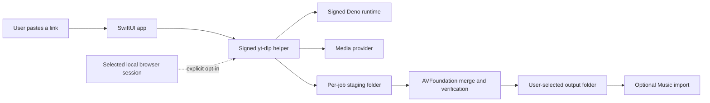

# Architecture

## Runtime boundary

Eucrante is one native Mac application. It has no backend and opens no listening port.

No cookies, source links, job manifests, or media files are sent to Eucrante-operated infrastructure. The provider necessarily receives its normal media request from the user's Mac.

## Components

| Component | Responsibility |
| --- | --- |
| SwiftUI app | URL entry, presets, settings, consent, queue/history, user feedback |
| `LocalMediaAcquirer` | Builds argument arrays, starts helpers without a shell, parses bounded progress, cancellation, and output discovery |
| `yt-dlp` | Provider extraction and media transfer |
| Deno | Local JavaScript runtime required by current YouTube extraction |
| `LocalMediaProcessor` | AVFoundation inspection, lossless video/audio merge, Apple conversion, and post-output verification |
| `JobStore` | Atomic local JSON persistence in Application Support |

## Trust boundaries

- Source URLs, titles, provider responses, media bytes, metadata, and filenames are untrusted.
- Untrusted values are passed to `Process` as individual arguments. Eucrante never builds a shell command.
- Helper paths are discovered only from the signed app resource directory, the development build directory, or explicit developer environment overrides.
- Browser access is disabled by default. The user selects a browser in Settings; no cookie file is exported or retained by Eucrante.
- Each job writes only into an opaque UUID staging directory. Remote titles are sanitized before becoming output filenames.
- A job completes only after AVFoundation opens the output and confirms non-empty usable media.

## Acquisition policy

The first local release chooses the best Apple-compatible YouTube tracks: H.264 MP4 video and AAC/M4A audio. This reliably supports up to the best H.264 format exposed to the selected session (commonly 1080p) and merges without re-encoding.

The planned 4K Best path will add a separately licensed, reproducibly built transcoder and use hardware HEVC only after HDR/color and cancellation fixtures pass. The UI and documentation must not claim 4K conversion until that path is shipped and verified.

## Release integrity

Helper versions and SHA-256 hashes are pinned in `Scripts/install-local-tools.sh`. The build fails on a hash mismatch. Nested executables are signed before the outer app is signed and notarized. Updating a helper requires a reviewed version/hash change, license review, tests, and a changelog entry.
