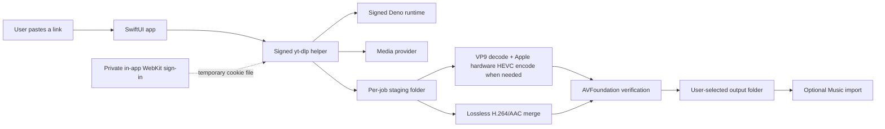

# Architecture

## Runtime boundary

Eucrante is one native Mac application. It has no backend and opens no listening port.

No cookies, source links, job manifests, or media files are sent to Eucrante-operated infrastructure. The provider necessarily receives its normal media request from the user's Mac. Eucrante never reads another browser's files.

## Components

| Component | Responsibility |
| --- | --- |
| SwiftUI app | URL entry, presets, settings, consent, queue/history, user feedback |
| `LocalMediaAcquirer` | Builds argument arrays, starts helpers without a shell, parses bounded progress, cancellation, and output discovery |
| `yt-dlp` | Provider extraction and media transfer |
| Deno | Local JavaScript runtime required by current YouTube extraction |
| In-app WebKit session | Optional YouTube sign-in stored in Eucrante's private app data, independent of external browsers |
| Minimal FFmpeg helper | Native VP9 decode and Apple VideoToolbox HEVC encode for 1440p/4K; no network, GPL, non-free, x264, or x265 components |
| `AppleVideoTranscoder` | Builds argument arrays, reports progress, cancels the helper, copies AAC, and requires hardware HEVC |
| `LocalMediaProcessor` | AVFoundation inspection, lossless video/audio merge, Apple conversion, and post-output verification |
| `JobStore` | Atomic local JSON persistence in Application Support |

## Trust boundaries

- Source URLs, titles, provider responses, media bytes, metadata, and filenames are untrusted.
- Untrusted values are passed to `Process` as individual arguments. Eucrante never builds a shell command.
- Helper paths are discovered only from the signed app resource directory, the development build directory, or explicit developer environment overrides.
- Authenticated access is disabled by default. The user signs in within Eucrante; no external browser data is read.
- Applicable cookies are exported to a mode-`0600` file in the opaque job folder only for acquisition and are deleted on both success and failure before any staging data can be retained. Startup removes an export left by a forced process termination before jobs resume.
- Each job writes only into an opaque UUID staging directory. Remote titles are sanitized before becoming output filenames.
- A job completes only after AVFoundation opens the output and confirms non-empty usable media.

## Acquisition policy

For video through 1080p, Eucrante chooses H.264 MP4 plus AAC/M4A and merges without re-encoding. For 1440p and above, where YouTube normally exposes separate VP9 video, Eucrante downloads VP9 plus AAC, decodes VP9 locally, and encodes HEVC through Apple VideoToolbox. The output is tagged `hvc1` in MP4 for Apple playback, while AAC is copied without another lossy encode.

The current path is verified for 4K SDR. HDR preservation is not yet claimed and remains gated on licensed HDR/color fixtures. AV1 input is not selected on Macs without a verified software AV1 decoder; VP9 is preferred with H.264 fallback.

## Release integrity

Helper versions and SHA-256 hashes are pinned in `Scripts/install-local-tools.sh` and `Scripts/build-ffmpeg.sh`. The build fails on a hash mismatch. FFmpeg is built from verified official source as LGPL 2.1-or-later with GPL/non-free/network functionality disabled. Nested executables are signed before the outer app is signed and notarized. Updating a helper requires a reviewed version/hash change, license review, tests, and a changelog entry.
