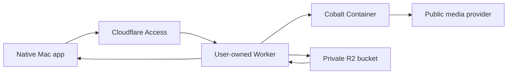

# Bring-your-own Cloudflare deployment

## Ownership rule

The project operates no shared media-processing backend. Every user deploys the complete stack into their own Cloudflare account and is responsible for its usage, cost, Access policy, retained media, and legal use. The Mac app stores only the resulting endpoint and authentication material; it never receives the user's Cloudflare management API token.

Workers Paid and R2 are required. Deployment automation must use least-privilege Cloudflare credentials, create or bind resources in that user's account, and avoid writing secrets to tracked files or command output.

## Stack



- **Worker:** validates identity and requests, exposes the app API, streams data without buffering whole media files, and mediates every R2 operation.
- **Container:** runs the user-owned Cobalt-compatible resolver in a normal process environment. It is never directly public.
- **R2:** stores durable job state and media. Public development URLs and public bucket access remain disabled.
- **Mac:** performs Apple-specific local processing and uploads the verified result back to the user's R2 job before marking it complete.

## R2 object contract

Each job uses an opaque cryptographically random identifier:

```text
jobs/<job-id>/manifest.json
jobs/<job-id>/resolution.json
jobs/<job-id>/inputs/<opaque-name>
jobs/<job-id>/outputs/<opaque-name>
```

The current manifest contains versioned state, timestamps, the selected policy, source hostname, artifact object keys, sizes, content types, and ETags. It does not contain authorization headers or a complete source URL. The private resolution object can contain short-lived upstream URLs and therefore is never exposed through a public R2 domain.

Transfers use R2 conditional and ranged reads. The Mac records the object ETag and verified byte count so a restarted background transfer can continue only if it is still the same object. Large output uploads use multipart upload and persist the upload ID plus completed part ETags in the job state. A stale incomplete multipart upload may be restarted after Cloudflare aborts its temporary parts; completed job objects are unaffected.

## Retention and deletion

Completed objects under `jobs/` have no expiration lifecycle and remain indefinitely until the user deletes the cloud job. Do not enable an indefinite bucket lock: a lock would conflict with explicit deletion.

The UI distinguishes three operations:

- **Remove from this Mac:** deletes only the selected local file after confirmation.
- **Remove from History:** hides/removes local history but leaves the R2 job intact.
- **Delete Cloud Job:** confirms, deletes every object under the job prefix, and removes its local record only after R2 confirms deletion.

The settings screen shows retained object count and byte usage so indefinite retention never becomes invisible cost.

## Authentication

Each deployment owner chooses an Access policy. The Mac app supports two private deployment modes:

- **WARP session:** an Allow policy includes the intended identity and requires a WARP device-posture rule. Enable WARP authentication for the Access application and route the custom hostname through the matching device profile. No reusable app secret is needed.
- **Service token:** a Service Auth policy includes a dedicated Eucrante token. When the account supports the selector combination, also require WARP or Gateway posture. Store both token values in macOS Keychain.

The maintainer deployment uses the WARP-session mode. It additionally disables `workers.dev` and preview URLs, exposes only the Access-protected custom hostname, and rejects requests that reach the Worker without the Access assertion added by Cloudflare.

The Worker URL remains unusable to non-matching devices even if discovered. Local development uses a separate localhost configuration and never weakens the production Access policy.

## Repository implementation

The deployable package lives in `Backend/` and currently provides:

- a versioned discovery document at `/.well-known/eucrante`;
- job creation plus private resolution persistence;
- direct streaming and multipart R2 uploads;
- conditional and byte-range artifact downloads;
- explicit deletion of every object under one opaque job prefix;
- a single Cobalt Container instance pinned to a specific linux/amd64 image digest.

Before the first account deployment, edit `Backend/wrangler.jsonc` with the real Access-protected hostname and a bucket name unique to the account. Keep `workers_dev` disabled. Then authenticate Wrangler and create the bucket:

```sh
cd Backend
pnpm install --frozen-lockfile
pnpm run check
wrangler login
wrangler whoami
wrangler r2 bucket create eucrante-jobs
wrangler deploy
```

Do not paste a general Cloudflare API token into the app or repository. Wrangler keeps its own deployment authorization. In WARP-session mode the Mac app stores only the endpoint; in service-token mode it receives only the narrowly scoped Access token.

## Operational boundaries

- No public default endpoint, public R2 domain, anonymous route, or shared project service.
- No Cloudflare management token in the app bundle, repository, logs, diagnostics, or R2.
- No media body buffering in Worker memory; bounded control JSON is the only buffered response type.
- No source URLs, filenames, authorization values, OAuth tokens, or response bodies in logs.
- Container and Worker versions are reported in deployment discovery and pinned for reproducible releases.
- Users can export a redacted manifest and verify R2 object checksums before deletion.
